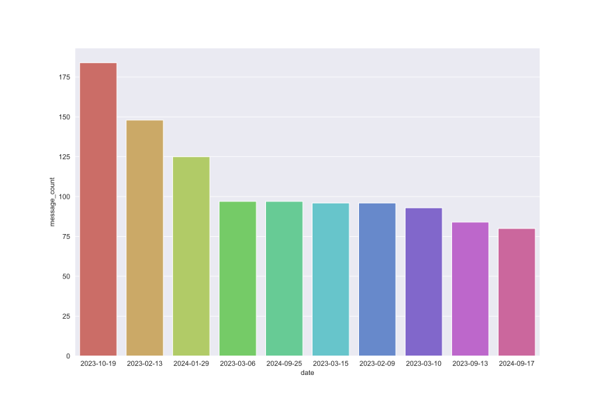
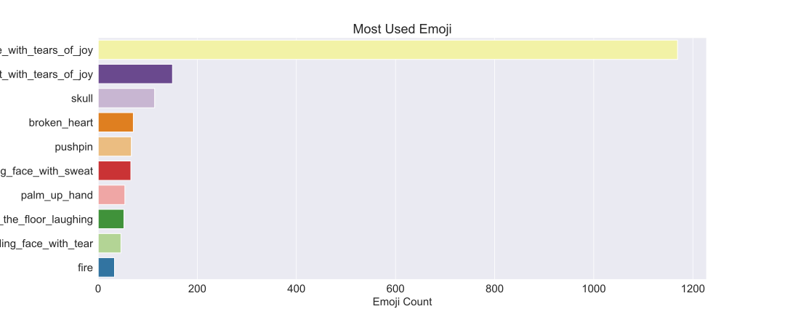
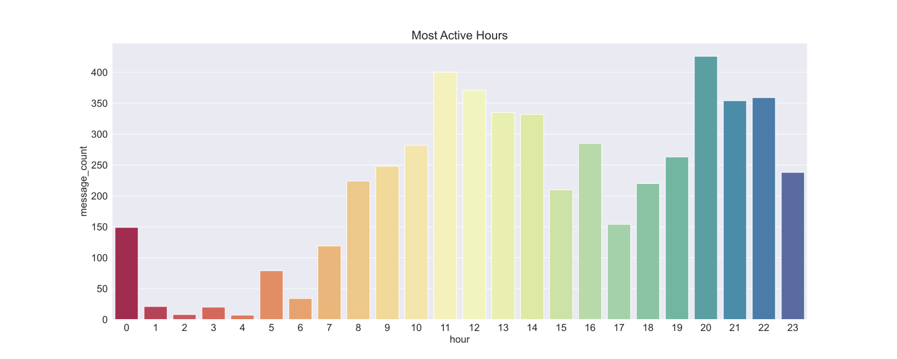
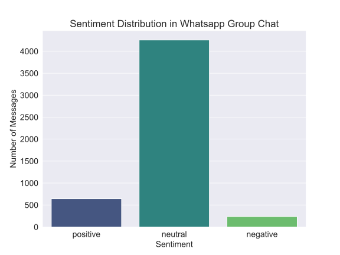
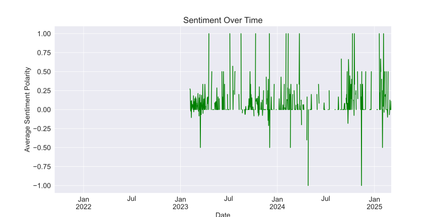
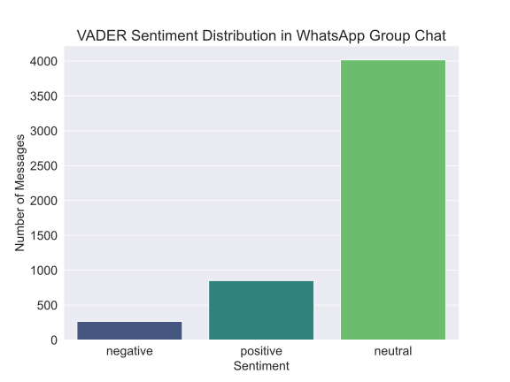

# A Comprehensive Data Analysis on a WhatsApp Group Chat

- Have a look at a **detailed [Medium Article](https://medium.com/@tusharnankani/an-exhaustive-whatsapp-chat-data-analysis-f8421a845c30)** for this project!
- [Whatsapp Chat Data Analysis - Notebook on GitHub](https://github.com/25thOliver/WhatsApp_Group_Chat-Analysis/blob/main/whatsappA/BSD_Group_Analysis.ipynb)

If the Notebook fails to load:
- Check the complete code, on [this basic HTML Page](https://github.com/25thOliver/WhatsApp_Group_Chat-Analysis).

## Overview

- [Introduction](#introduction)
- [Data Retrieval & Preprocessing](#data-retrieval--preprocessing)
- [Exploratory Data Analysis](#exploratory-data-analysis)

  - **[Overall frequency of total messages on the group.](#the-overall-frequency-of-total-messages-on-the-group)**
  - **[Top 10 most active days.](#top-10-most-active-days)**
  - **[Top 10 active users on the group (with a twist)](#top-10-active-users-on-the-group)**
    - Ghosts present in the group. (shocking results.)
  - **[Top 10 users most sent media.](#the-top-10-users-who-send-the-most-media)**
  - **[Top 10 most used emojis.](#top-10-most-used-emojis)**
  - **[Most active hours and days.](#top-10-most-used-emojis)**
    - Heatmaps of weekdays and months.
    - Most active hours, weekdays, and months.
  - **[Most used words - WordCloud](#most-used-words-in-the-whole-chat)**
  - **[Sentimental Analysis](#)**
  
- [Conclusion](#conclusion)

# Introduction:

WhatsApp has swiftly risen to the top of the global text and voice messaging market.  With more than 1.5 billion monthly active users and a focus on cross-platform communications, it is the most widely used mobile chat program globally.

- I considered a number of projects that would allow me to analyze data, such as The cliched Covid-19 Data Analysis or the Nairobi Air Quality Index.

- However, I reasoned that I could do Data Analysis on a WhatsApp group chat of university students and learn fascinating things like who is most active, who are ghosts (those who don't respond), my sleep schedule, the most used emoji, the sentiment score of each individual, who swears the most, the most active times of the day, or does the group use phones during university classroom hours? 

- Since the individuals in this talk are people I know personally, these would undoubtedly be some fascinating insights, more for me than for you.

# Data Retrieval & Preprocessing
### Beginning. How do I export my conversations? From Where To Obtain Data?

- The first step is Data Retrieval & Preprocessing, that is to gather the data. WhatsApp allows you to **export your chats** through a **.txt format**. 

- Go to the respective chat, which you want to export!

- Tap on **options**, click on **More**, and **Export Chat.**

- I will be Exporting **Without Media.**

### Opening this .txt file up, you get messages in a format that looks like this:

# Exploratory Data Analysis

### Importing Necessary Libraries

We will be using :
1. **Regex (re)** to extract and manipulate strings based on specific patterns.
    - References:
        - [Regex - Python Docs](https://docs.python.org/3/library/re.html)
        - [Regex cheatsheet](https://www.rexegg.com/regex-quickstart.html)
        - [Regex Test - live](https://regexr.com/)
        - [Datetime Format](http://strftime.org/)
2. **pandas** for analysis.
3. **matlotlib** and **seaborn** for visualization.
4. **emoji** to deal with emojis.
    - References:
        - [Python Docs](https://pypi.org/project/emoji/)
        - [Emoji](https://github.com/carpedm20/emoji)
        - [EMOJI CHEAT SHEET](https://www.webfx.com/tools/emoji-cheat-sheet/)
5. **wordcloud** for the most used words.
6. **datetime** for datetime manipulation.

### Preparation and reading data

You can't read the file line by line and obtain every message you want since WhatsApp texts are multi-line.  Rather, you need a method to determine whether a line is part of an old message or a new one.  Regular expressions may be used for this, but I chose a simpler approach that splits the time formats and turns a Raw.txt file into a DataFrame.

I use a comma to divide each line as I read it, then I take the first result from the `split()` method.  A valid date would be the first item on the line if it were a new message, and it would be added to the list of messages as a new message.  If not, the message will be attached to the end of the preceding message as a single, continuous message because it is a part of the prior message.

# Pre-Processing

Firstly, let’s load our .txt into a DataFrame.

The dataset now contains 3 columns - DateTime String, User, and Message sent and their respective entries in 13655 rows.

**Let’s create some helper columns for better analysis!**

Now that we have a clean DataFrame to work with, it’s time to perform analysis on it. **Let’s start Visualizing!**

# Exploratory Data Analysis

At this point, I think I’m ready to start my analysis so I will plot a simple line graph to see the frequency of messages over the months. 

## The overall frequency of total messages on the group

I expect to see a nice line graph with crests and troughs in odd places.

## Top 10 Most Active Days
Grouping the data set by date and sorting values according to the number of messages per day.

Apparently, the group was very active on 13th September’20 because we were discussing fundamental yet tricky and brain-wracking “Guess the Output” Java questions!

## Top 10 active users on the group

Before analyzing, the top users, let’s find out how many ghosts are there in the group!

#### Shocking Result
- Total number of people who have sent at least one message on the group are **178**.
- BUT, the total number of participants were **145**. This is beacuse the had had members joining others leaving along the way.
- **That means -35 people in the group have not sent even a single message throughout these 9 months and 5138 messages.** Recheck this! 

### Now, pre-processing the top 10 active users.

## Now, visualizing top 10 active users.
### Replacing names with initials for better visualization

### Starting with a basic plot.
- [Color References for Matplotlib](https://matplotlib.org/3.1.0/gallery/color/named_colors.html)

- **Improving Default Styles using Seaborn**

    - [References](https://seaborn.pydata.org/generated/seaborn.set_style.html)

## Now, I will be trying different visualization methods.

# Note

I'll give each character a distinct color as practically every plot will compare them to one another, making it simple to recognize them across several stories. 

 - I had the option of using Seaborn's color scheme, but:  Seaborn uses its own default color scheme, however I wanted a character's color to be constant throughout the story;   I also got my color palette from https://coolors.co/ because I wanted to experiment with different hues.

 - I write a function that, given a list of names, rearranges colors to correspond with the plot's ordering.  This function returns a rearranged list of colors after receiving the sorted names as input.  In a seaborn plotting function, this list must be provided into the `pallete` input.

## Defining a function to tackle the problem.

In order to keep each character's color consistent over all plots, I'm writing the following function.  This is supplied to the function that will rearrange colors in a specific order because the order will change based on the plot. This way, the color of a particular person will always be the same regardless of the plot.  This will make the numerous graphs I'll be plotting more readable and consistent.

### Now, we have a really nice set of colours for each person, with which we can visualize using `sns.palplot`.

#### Pic with dictionary of names comes below

## Now, finding the average message length of the 10 most active users of the group.

## Now, we will be plotting most sent messages and respective average message lengths simultaneously, to see some interesting results.
- Plotting multiple charts in a grid
    - Matplotlib and Seaborn also support plotting multiple charts in a grid, using `plt.subplots`, which returns a set of axes that can be used for plotting.

### Plots like this are fascinating to see side by side because of the twist:

 Interestingly Amisi, who sent the most texts (more than 350), had the third-shortest average message length.  This indicates that the sender sends a large number of broken WhatsApp messages at once. 

 We may observe that Twiri sends a lot of messages, but they are comparatively longer.

 Peter sends comparatively fewer messages, but they are longer.

### Sometimes things aren't as they seem.

# Top 10 users most sent media 

- The exported chats were exported without any media files. Any message that contained media was indicated with `‘<Media Omitted> ’`. 

### Pre-processing

**We can use this to filter out and see who sends the most media.**

### Visualization using different Seaborn's Color Palettes
- [Seaborn References](http://seaborn.pydata.org/tutorial/color_palettes.html#using-circular-color-systems)
- [Seaborn's Different Colors](https://medium.com/@andykashyap/top-5-tricks-to-make-plots-look-better-9f6e687c1e08)
- [Seaborn's Color Visualization](https://python-graph-gallery.com/197-available-color-palettes-with-matplotlib/)

###### QUICK HACK
- to get **all possible Seaborn's color palettes**:
    - Just put a random input `palette="xyz"`
    - It will then show an error, showing all possible palettes you can try out from!
 
### Which user sends the most media?

Alright, moving on to a more detailed analysis of the dataset!

**TK and DL** are beating everyone by a *huge margin*. They, also rank the *top in total messages*, though *last in average message length*. ***Most dedicated contributor award goes to TK and DL!***

## Top 10 most used Emojis

Will be using the `emoji` module, that was imported earlier.

Will create another helper column using `emoji.demojize("<emoji>")`, since **emojis will not be rendered in the plots**.

Since the emojis **will not be rendered into the plots**, here is how the *top10emojis dataset looks like*!

### Which Emoji is the most used in the chat?

This time, it will be plotted a bit differently. Numbers will be plotted on x-direction.

- Not that it is worth anything, but “😂” beats everyone by a huge margin!

## Most active days, most active hours, most active months.

Now, I will be analyzing the timely usage of the groups.

#### Pre-processing for most active hours.

### Which hour of the day are most messages exchanged?

Interestingly, the group is most active around midnight, followed by afternoon.

### Pre-processing Weekdays and Months

Now, irrespective of the number of messages per day or month, we want the order to be remain the same, hence we will be using the order argument in seaborn.

- Plotting multiple charts using `plt.subplots`.

## Visualization
### Now, we will be plotting *grouped by day* and respective *group by month* simultaneously, to see some interesting results.
- Using `plt.subplots` to plot multiple charts in a grid.

## Inferences

##### The group is most active on Mondays, and least active on Saturday (probably guys are out partying!)
##### It has been recently very active, in Febraury, March, September and October mid semesters.
##### Least active months are between May and August, this is when we're on Summer holidays

To get a clearer understanding, we will plot a combined graph — **Heatmap**.

#### Now, we will plot a heatmap, combining the above to bar plots, for a better understanding!

### Heatmap of Month sent and Day sent

##### Inferences

- The group is more active on weekdays, throughout the months that we're in for semesters.
- This gives a combined analysis, which is really helpful in real-time projects.

## Most Used Words in the whole chat.

I will be using the `wordcloud` module, to create a WordCloud of the **most used words**! I will be *adding some common words, to the stopwords*, such that it will not be included the WordCloud.

### Most Used Words in the chat

The recursive nature of gathering data on the members present during that semester is the reason why its members' official names show up in WordCloud's most used words. Their names appear as the most used words since they typically use the copy and paste feature to make the list.

### Sentiment Analysis

### Plot Sentiment Distribution

### Swear Word Detection

### VADER for Sentiment Analysis
VADER (Valence Aware Dictionary and Sentiment Reasoner) is a lexicon and rule-based sentiment analysis tool specifically designed for social media text. It provides a more nuanced sentiment score (positive, negative, neutral, and compound).

##### VADER Sentiment Visualization

#### Plot VADER sentiment over time

#### Swear Word Usage

# Conclusion

**That’s it from my end! I hope you learned and enjoyed a lot!**

